# Frontend Mentor - Space Tourism Website - Vue

## The challenge

Your challenge is to build out this multi-page space tourism website and get it looking as close to the design as possible.

**This project is a collaboration between us, Scrimba, and Kevin Powell.**

Please use any tools you like to help you complete the challenge. So if you've got something you'd like to practice, feel free to give it a go.

If you choose to use a JS-heavy approach, we provide a local `data.json` file for the different page data. This means you'll be able to pull the data from there instead of using the separate `.html` files.

Your users should be able to:

- View the optimal layout for each of the website's pages depending on their device's screen size
- See hover states for all interactive elements on the page
- View each page and be able to toggle between the tabs to see new information

## Project Setup

```sh
npm install
```

### Compile and Hot-Reload for Development

```sh
npm run dev
```

### Compile and Minify for Production

```sh
npm run build
```

## Screenshots

Desktop optimised for max width 1536px

Desktop home
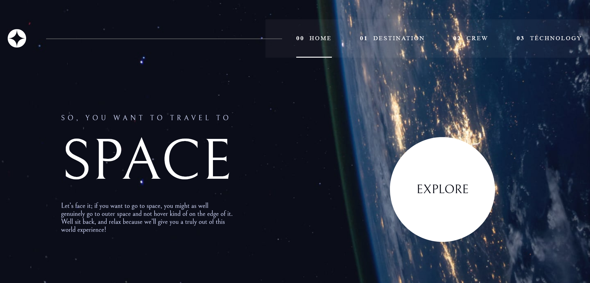

Desktop destination
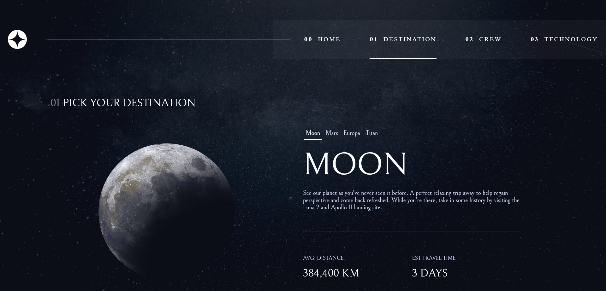

Desktop crew
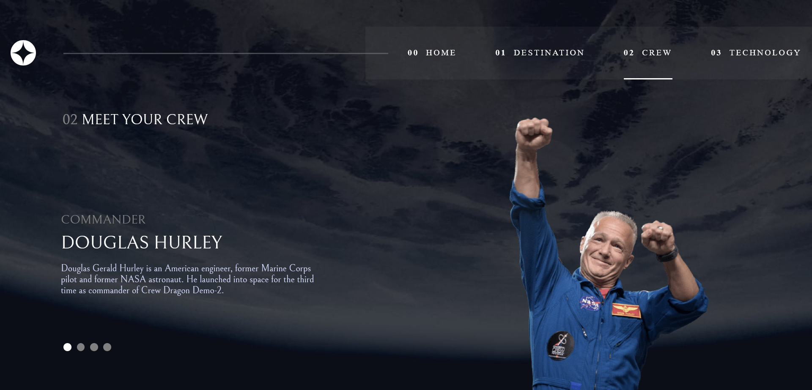

Desktop technology
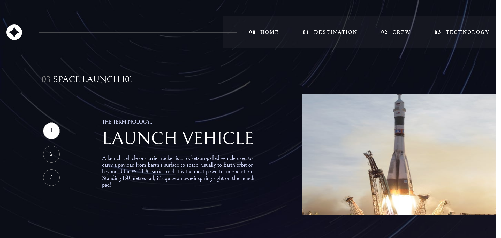

Tablet home
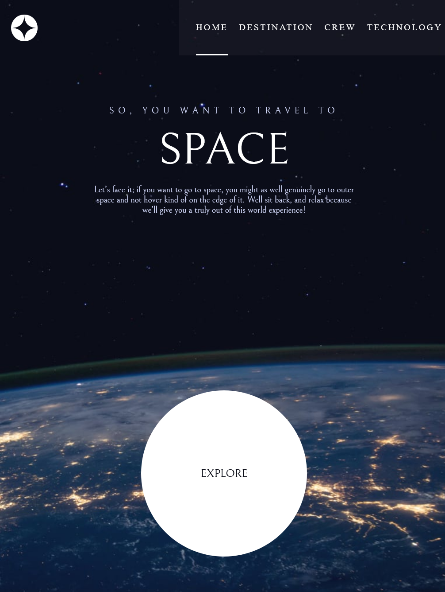

Tablet destination
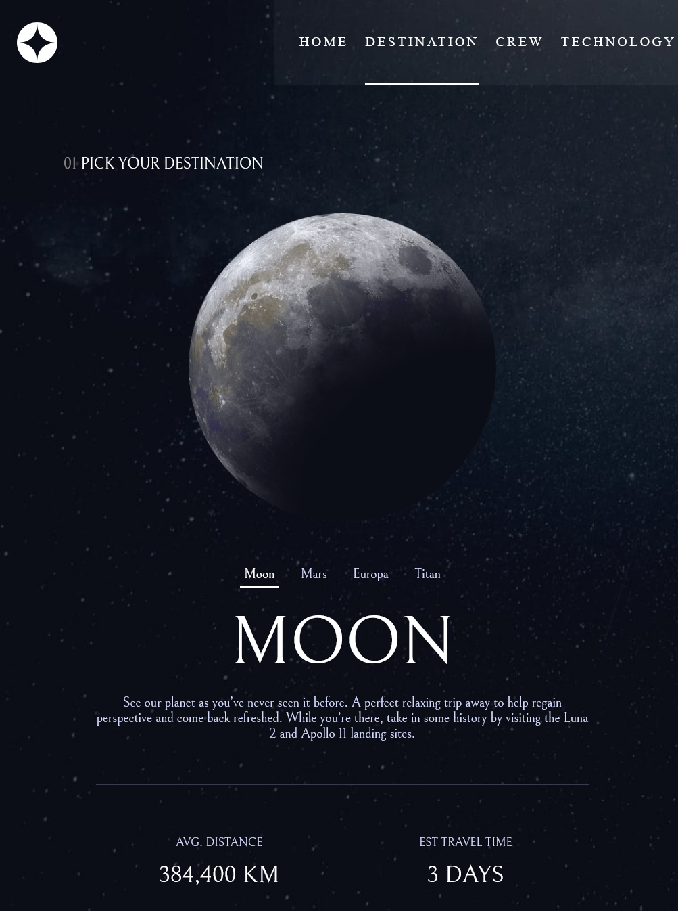

Tablet crew
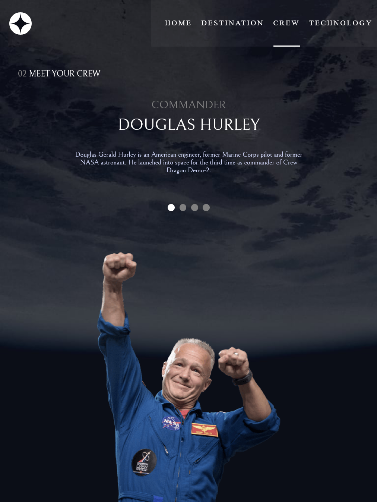

Tablet technology
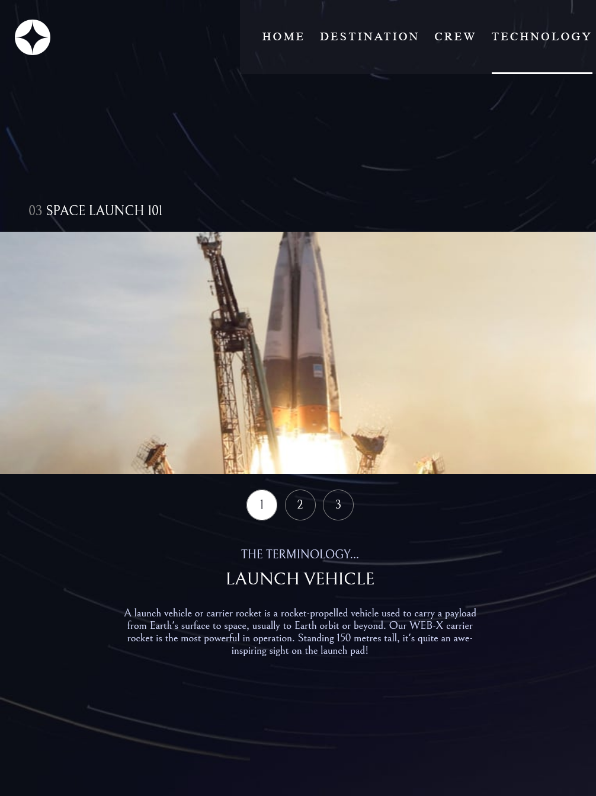

Mobile home\
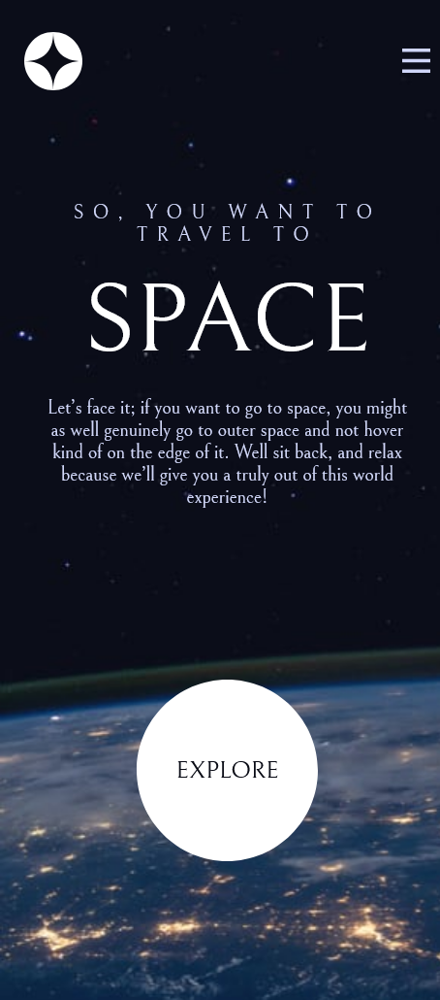

Mobile destination\
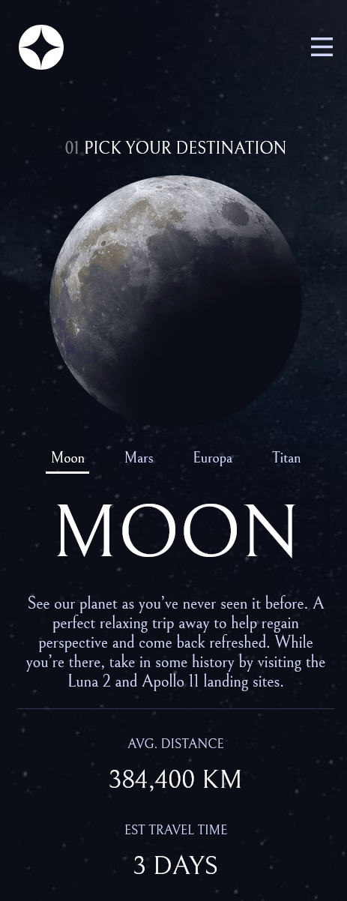

Mobile crew\
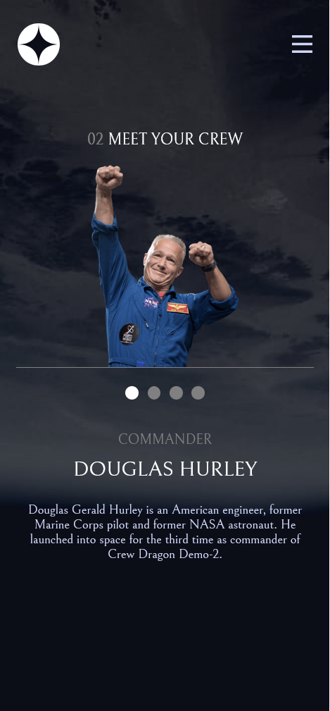

Mobile technology\
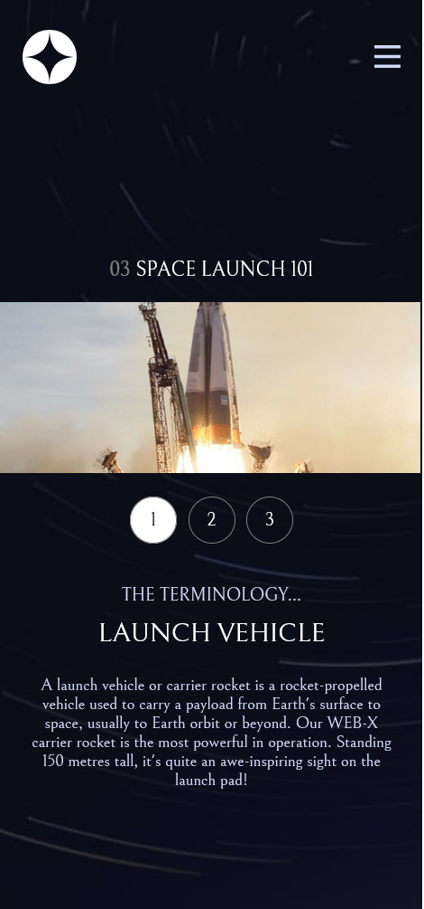
